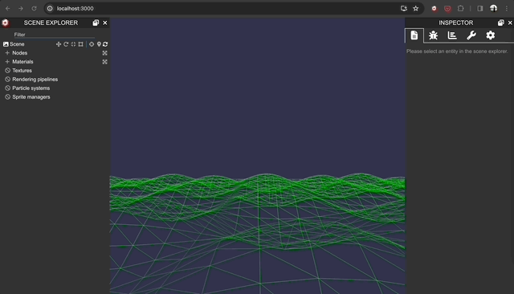

# React Babylon.js Boilerplate

This package is a boilerplate for a React project that integrates Babylon.js, a powerful 3D rendering engine for the web. The boilerplate includes dependencies for Babylon.js and related modules, such as Babylon GUI components, loaders, materials, and serializers. It also incorporates testing libraries, TypeScript for type-safe JavaScript, and various development tools.

Try It on Codesandbox [here!](https://codesandbox.io/p/github/seacloud9/React-Babylon.js-Boilerplate/main)

## Key Features and Dependencies:

- **React and ReactDOM:** The core libraries for building user interfaces in React.
- **React-BabylonJS:** A React renderer for Babylon.js, allowing seamless integration of Babylon.js features into React applications.
- **WebXR Polyfill:** A polyfill to enable WebXR support in browsers that do not natively support it.
- **Zustand:** A state management library for React applications.
- **Testing Libraries:** Jest, testing-library/react, and testing-library/jest-dom for testing React components.
- **TypeScript:** A superset of JavaScript that adds static typing and other features for improved developer experience.
- **Craco:** A configuration layer for Create React App, providing additional customization options.
- **Prettier:** A code formatter to maintain consistent code style.
- **Eslint:** A tool for identifying and fixing problems in JavaScript and TypeScript code.
- **Babylon.js Inspector:** A debugging tool for Babylon.js, enabling inspection and manipulation of scenes during development.
- **Compression Webpack Plugin:** A Webpack plugin for compressing assets to improve loading times.

## Scripts

Scripts are provided for common development tasks such as starting the development server, building the project, running tests, and formatting code. The package also includes a set of development dependencies for tools like Craco, Prettier, and the Babylon.js Inspector.

This boilerplate aims to provide a foundation for creating React applications with Babylon.js for 3D graphics and interactions, along with the necessary tools for testing and code quality. Developers can use it as a starting point for building immersive and interactive web experiences.

### `yarn format:fix`
Auto fixes more formating issue with prettier

## Available Scripts

In the project directory, you can run:

### `yarn start`

Runs the app in the development mode.\
Open [http://localhost:3000](http://localhost:3000) to view it in the browser.

The page will reload if you make edits.\
You will also see any lint errors in the console.

### `yarn test`

Launches the test runner in the interactive watch mode.\
See the section about [running tests](https://facebook.github.io/create-react-app/docs/running-tests) for more information.

### `yarn build`

Builds the app for production to the `build` folder.\
It correctly bundles React in production mode and optimizes the build for the best performance.

The build is minified and the filenames include the hashes.\
Your app is ready to be deployed!

See the section about [deployment](https://facebook.github.io/create-react-app/docs/deployment) for more information.

### `yarn eject`

**Note: this is a one-way operation. Once you `eject`, you can’t go back!**

If you aren’t satisfied with the build tool and configuration choices, you can `eject` at any time. This command will remove the single build dependency from your project.

Instead, it will copy all the configuration files and the transitive dependencies (webpack, Babel, ESLint, etc) right into your project so you have full control over them. All of the commands except `eject` will still work, but they will point to the copied scripts so you can tweak them. At this point you’re on your own.

You don’t have to ever use `eject`. The curated feature set is suitable for small and middle deployments, and you shouldn’t feel obligated to use this feature. However we understand that this tool wouldn’t be useful if you couldn’t customize it when you are ready for it.

## Learn More

You can learn more in the [Create React App documentation](https://facebook.github.io/create-react-app/docs/getting-started).

To learn React, check out the [React documentation](https://reactjs.org/).
